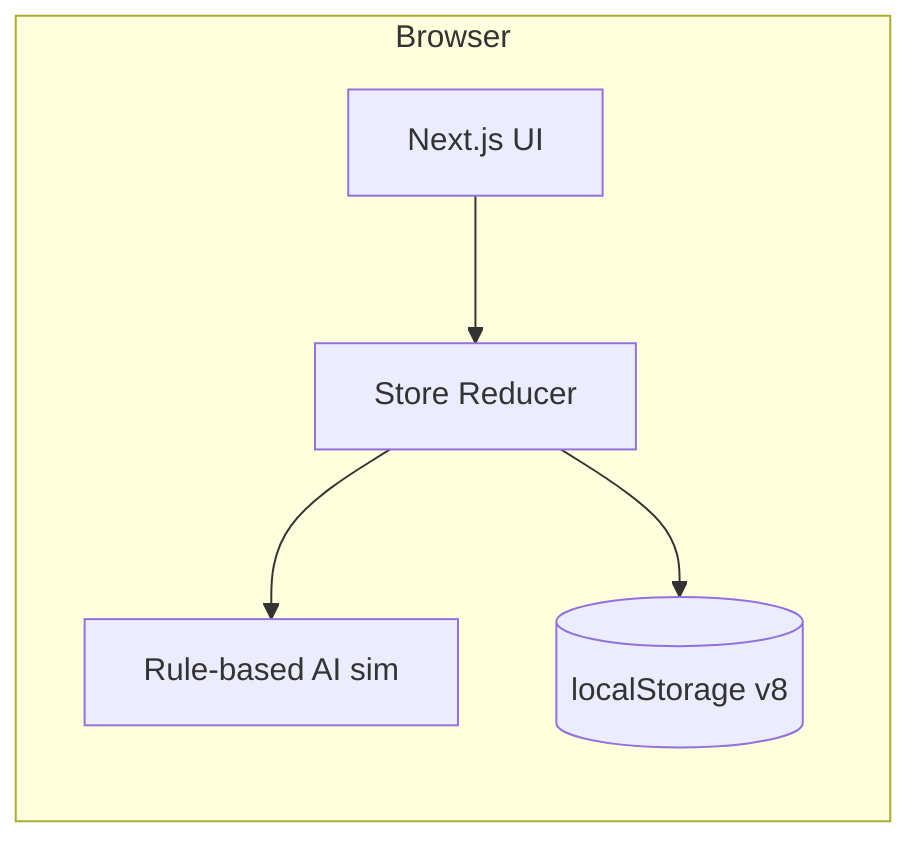
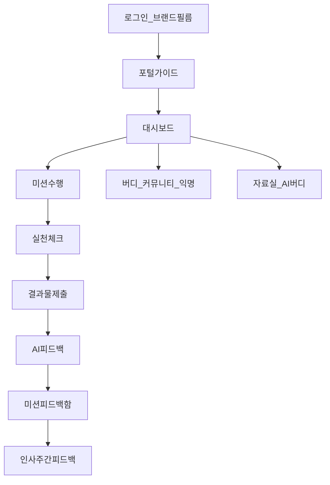
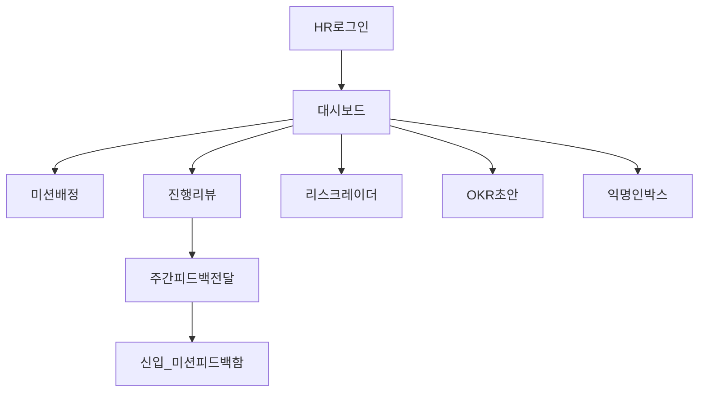

# IX Compass  
## 인터엑스 핵심가치 연계형 신규 입사자 온보딩 포털  
### 발표용 제안서 · 보고서

| 항목 | 내용 |
|------|------|
| 프로젝트명 | **IX Compass** |
| 한 줄 요약 | 12가지 핵심가치(DNA) 내재화 · 주간 미션·AI 피드백 · 쉬운 소통을 한 포털에서 완주하게 하는 AX 온보딩 프로토타입 |
| 역할 | 기획 · 개발 · 디자인 총괄 **1인 바이브코딩** |
| 기획 툴 | Gemini 80% · Cursor 15% · GPT 5% |
| 개발 툴 | Cursor 100% |
| 대상 | 인터엑스 AX 인턴 오디션 · 신규 입사자 온보딩 포털 구축 시나리오 |
| 데모 URL | https://ix-compass.vercel.app (프로덕션) |

---

## 목차 (Index)

1. [개요](#1-개요-overview)  
2. [배경 및 필요성](#2-배경-및-필요성-background)  
3. [주요 기능 및 기획](#3-주요-기능-및-기획-features)  
4. [시연 및 시각 자료](#4-시연-및-시각-자료-demo)  
5. [성과 및 검증](#5-성과-및-검증-results)  
6. [결론 및 향후 계획](#6-결론-및-향후-계획-conclusion)  

---

## 1. 개요 (Overview)

### 1.1 프로젝트명 및 핵심 주제

**IX Compass**는 인터엑스의 가파른 성장과 함께 합류하는 다양한 배경의 신규 입사자가, 회사의 **비전·12가지 핵심가치**를 인터랙티브하게 체화하고, **주차별 미션과 피드백**을 주도적으로 이어가며, **인사팀·동료와 유기적으로 소통**할 수 있도록 설계한 온보딩 포털 프로토타입입니다.

생성형 AI 경험을 온보딩 플로우에 접목하되, 데모·발표 환경에서는 **규칙·키워드 기반 온디바이스 AI 시뮬레이션**으로 핵심 여정을 재현합니다.

### 1.2 발표 흐름 안내

| 순서 | 장 | 핵심 메시지 |
|------|----|-------------|
| 1 | 개요 | 무엇을, 누가, 어떤 방식으로 만들었는가 |
| 2 | 배경 | 왜 필요한가 — 문제 3축과 벤치마크 |
| 3 | 기능 | 누구에게 무엇을 — 신규입 vs 인사, 기술 구조 |
| 4 | 시연 | 어떻게 쓰는가 — 여정 맵 · 데모 |
| 5 | 성과 | 무엇을 달성·기대하는가 |
| 6 | 결론 | 한계, 다음 단계, Q&A |

---

## 2. 배경 및 필요성 (Background)

### 2.1 문제 정의 (Problem)

본 프로젝트는 인터엑스 **채용공고 시나리오**를 출발점으로 합니다.  
총괄 담당자 관점에서 “신규 입사자가 비전·문화를 입체적으로 경험하고, 인사팀과 유기적으로 소통하며, 핵심가치를 내재화한 채 주간 미션·피드백을 이어갈 수 있는 포털”이 필요하다는 과제가 주어졌습니다.

> **채용공고 시나리오 (요약 인용)**  
> *인터엑스 핵심가치 연계형 신규 입사자 온보딩 포털 구축*  
> 인터엑스의 가파른 성장세에 따라 다양한 배경을 가진 인재들이 합류하고 있습니다. 여러분은 이번 [신규 입사자 온보딩 포털 구축] AX 프로젝트의 총괄 담당자로 임명되었습니다.  
> 새로운 동료들이 인터엑스의 비전과 문화를 한층 더 입체적이고 몰입감 있게 경험하며, 인사팀과 유기적으로 소통할 수 있는 환경을 만들고자 합니다.  
> 신규 입사자가 12가지 핵심가치를 인터랙티브하게 내재화하고 주차별 온보딩 미션과 피드백을 주도적으로 이어갈 수 있도록, 생성형 AI 기술을 접목한 [온보딩 포털 프로토타입]을 구현해 주세요.  
> 개발 스택이나 도구의 제한은 없으며, 포털 내 세부 기능 또한 자유롭게 제안해 주시면 됩니다.

### 2.2 문제 → 기획 의도 & 방향

| 문제 정의 | 기획 의도 · 방향 |
|-----------|------------------|
| 핵심가치 내재화의 한계 (암기형·일회성 교육) | **쉬운 적용** — 오늘 업무에 바로 붙는 실천 |
| 온보딩 로드맵 · 피드백 시스템 결여 | **쉬운 운영** — 미션·피드백·리스크를 한곳에서 |
| 정서적 고립감 · 조기 적응 위험 | **쉬운 소통** — 질문·관계·익명 채널을 낮게 |

### 2.3 시장 · 현황 분석 (벤치마크)

빅테크 온보딩의 검증된 아이디어를 차용하고, **인터엑스 홈페이지 톤앤무드**에 맞춰 UX·UI를 동기화했습니다.

#### (1) Apple — Unboxing Experience (핵심 요약)

- 입사 첫날, 미개봉 기기·웰컴 팩·축하 메시지로 **제품을 처음 개봉하는 감동**을 EX(Employee Experience)로 이식.
- 전직 직원 회고(Mashable / Business Insider 등): 자리 위 새 제품 박스가 ‘언박싱’을 연상시킨다는 경험.

**IX Compass 반영**  
로그인 직후 **브랜드 필름 · 3D 인터랙션 인트로**로 “선물 받는 첫날” 감각을 연출. 대시보드 히어로는 슬로건 **「다시 제조, 다시 대한민국」**과 영상으로 브랜드 몰입을 유지.

#### (2) Google — Just-in-Time Nudge (핵심 요약)

- 긴 매뉴얼·강제 교육 대신, **적시(Just-in-Time) · 실행 가능(Actionable)** 한 짧은 넛지.
- 매니저 인박스로 전달되는 체크리스트 예: 역할·책임 대화, **온보딩 버디** 지정, 소셜 네트워크 구축, 1:1 미팅, 열린 소통.

**IX Compass 반영**

| 구글 넛지 아이디어 | 포털 연결 |
|-------------------|-----------|
| 역할·비전 공유 | 소개 · 비전 & 핵심가치 · 웰컴 가이드북 |
| 버디 지정 | 조직 & 담당자 · 멘토/버디 |
| 질문하기 쉬운 환경 | AI 버디 · FAQ · 자료실 |
| 정기 피드백 | 미션 AI 피드백 + 인사팀 **주간 피드백** 전달 |
| 관계·소속감 | 커뮤니티 · 동료 프로필 · 익명 피드백 |

### 2.4 기획 의도 및 목표 (Goal)

**해결 방향 한 줄:** 쉬운 소통 · 쉬운 질문 · 쉬운 적용.

#### 문제 → 방향 → 목표 기능

| 문제 | 방향 | 목표 기능 (구현) |
|------|------|------------------|
| 핵심가치 내재화 한계 | 쉬운 적용 | **AI 업무 가이드(실천 체크)** · Context Checklist(관련 DNA 중심) · (+ 보조: 대시보드 시나리오) |
| 로드맵·피드백 결여 | 쉬운 운영 | **미션 수행(미션→실천→제출)** · **AI 피드백** · 인사 **주간 피드백** · OKR 초안 · 리스크 레이더 · 캘린더·체크리스트 |
| 정서적 고립 · 적응 위험 | 쉬운 소통 | **AI 익명 피드백** · (+ 보조: 커뮤니티) · **AI 버디** · (+ 보조: 자료실·FAQ) |

---

## 3. 주요 기능 및 기획 (Features)

### 3.1 타깃 유저 및 핵심 기능

#### A. 신규 입사자 — 정보 · 가치 적용 · 소통

| 니즈 | 핵심 기능 | 제공 가치 |
|------|-----------|-----------|
| 정보 · 궁금증 해소 | 소개(비전·문화·가이드북), 자료실, FAQ, 용어 사전, **AI 버디** | 필요할 때 바로 질문·검색 |
| 가치 기반 업무 적용 | **미션 수행** (미션 → 실천 → 제출), DNA 연계 가이드, 시나리오 | 핵심가치를 ‘오늘 할 일’로 변환 |
| 진행 가시화 | 대시보드(다음 할 일·진행률·일정·체크리스트), 캘린더, 30-60-90 체크리스트, 월간 OKR | 한눈에 다음 행동 파악 |
| 정서 · 관계 | 멘토/버디, 동료 프로필, 공지·팀 채널, **익명 피드백** | 고립감 완화 · 안전한 발화 |
| 피드백 축적 | **미션 피드백** 탭 (AI 코치 + 인사 주간 피드백 모음) | 미션 페이지와 분리된 ‘모아보기’ |
| 첫 경험 | 로그인 브랜드 필름 · 온보딩 포털 가이드 | 언박싱형 몰입 · 핵심 여정 안내 |

#### B. 인사팀 — 관계 구축 · 운영 효율

| 니즈 | 핵심 기능 | 제공 가치 |
|------|-----------|-----------|
| 미션 운영 | **미션 배정** (주간 템플릿·맞춤 배정) | 코호트 단위 온보딩 설계 |
| AI 검토 → 사람 피드백 | **진행 리뷰** — AI 요약·리스크 확인 후 **주간 피드백 전달** | 프라이빗 노트 원문 비노출 · 주간 코칭 루프 |
| 적응 · 리스크 모니터링 | **리스크 레이더**, 대시보드 대기 큐 | 조기 개입 신호 |
| 목표 정렬 | **OKR 초안** 생성·승인 흐름 | 입사자별 다음 달 목표 초안 효율화 |
| 정서 채널 관리 | 익명 피드백 인박스 (익명화·요약) | 신원 노출 없이 이슈 파악 |

### 3.2 차별화 포인트

1. **미션 × AI 가이드 단일 페이지** — 미션 확인 → 실천 체크 → 결과물 제출 → AI 피드백까지 한 흐름.  
2. **피드백 이원화** — 미션 페이지의 AI 코치와, 피드백 탭에 쌓이는 **인사 주간 피드백**을 역할별로 분리.  
3. **Context Checklist** — 12개 가치를 매일 전부하지 않고, 오늘 업무에 맞는 DNA·실천 항목을 추천.  
4. **브랜드 일체감** — InterX 워드마크·오렌지 액센트·히어로·슬로건으로 사내 포털이 아닌 ‘제품’ 수준의 첫인상.

### 3.3 정보 구조 (IA) 요약

| 상단 메뉴 | 주요 하위 | 역할 |
|-----------|-----------|------|
| 대시보드 | — | 다음 할 일 · 진행 · 일정 요약 |
| 소개 | 비전 & 핵심가치, 조직문화, 웰컴 가이드북 | 철학·문화 온보딩 |
| 온보딩 여정 | 미션 수행(신입) / 미션 배정(인사), 월간 OKR, 캘린더, 체크리스트 | 실행 축 |
| 조직 & 담당자 | 조직도, 멘토/버디, 동료, 공지·팀 채널 | 사람 · 관계 |
| 자료실 | 툴·시스템, 용어, FAQ, AI 버디 | 지식 · 질문 |
| 피드백 | 미션 피드백(신입), 진행 리뷰·리스크(인사), 익명 피드백 | 피드백 · 리스크 |

### 3.4 시스템 구조 · 기술 스택

| 구분 | 내용 |
|------|------|
| 프레임워크 | **Next.js 16** (App Router) |
| UI | **React 19**, **TypeScript 5**, **Tailwind CSS 4** |
| 모션 · 3D | **Three.js**, **React Three Fiber / Drei**, **GSAP** (브랜드 필름) |
| 상태 · 저장 | 클라이언트 Reducer + **localStorage** (`ix-compass-state-v8`) |
| 데이터 | 서버 DB 없음 — **Seed 코호트** 기반 오프라인 데모 |
| AI | `src/lib/ai.ts` 규칙·키워드 기반 시뮬레이션 (가이드 추천, 미션 피드백, 익명화, AI 버디 응답 등) |
| 배포 | Vercel 프로덕션 (`ix-compass`) |

**프로토타입 전제:** 실제 LLM API·사내 IdP·Slack 연동 없이, 발표·오디션에서 **엔드투엔드 여정**을 재현하는 데 초점을 둡니다.

---

## 4. 시연 및 시각 자료 (Demo)

### 4.1 실제 시연

| 유형 | 상태 |
|------|------|
| 라이브 프로토타입 | https://ix-compass.vercel.app |
| 시연 영상 | **[시연 영상 삽입 예정]** |
| UI 캡처 | PPT 제작 시 대시보드 · 미션 수행 · 피드백 · 브랜드 필름 화면 삽입 권장 |

### 4.2 유저 시나리오 · 여정 맵

#### 신규 입사자

1. 로그인 → 브랜드 필름(언박싱형 인트로)  
2. 포털 가이드(대시보드 → 미션 → 소개 → 조직 → 자료실)  
3. 대시보드에서 **다음 할 일** 확인  
4. **미션 수행**: 미션 확인 → AI 실천 체크 → 결과물 제출 → AI 피드백  
5. **미션 피드백** 탭에서 AI·인사 주간 피드백 모아보기  
6. 막히면 AI 버디·FAQ·익명 피드백·버디/커뮤니티 활용  

#### 인사팀

1. 로그인(HR) → 대시보드에서 대기 피드백·리스크 요약  
2. **미션 배정**으로 주차·맞춤 미션 운영  
3. **진행 리뷰**에서 AI 요약·리스크 확인 → **주간 피드백 작성·전달**  
4. 필요 시 리스크 레이더 · OKR 초안 · 익명 인박스  

---

## 5. 성과 및 검증 (Results)

### 5.1 프로토타입 달성 (목표 대비)

본 단계는 **실서비스 KPI 실측 전**이므로, 채용 시나리오 요구 대비 **구현 완성도**로 검증합니다.

| 요구 | 달성 |
|------|------|
| 핵심가치 인터랙티브 내재화 | DNA 소개 + Context Checklist 실천 루프 |
| 주차별 미션 · 피드백 | 미션 배정/수행/제출 · AI 피드백 · 인사 주간 피드백 |
| 인사팀과 유기적 소통 | 진행 리뷰, 익명 채널, 리스크·OKR |
| 생성형 AI 접목 | 가이드·피드백·익명화·AI 버디 시뮬레이션 |
| 몰입형 첫 경험 | 브랜드 필름 · 히어로 · InterX UI 톤 |

### 5.2 기대효과 (문제 → 기능 → 효과)

| 문제 | 방향 | 기능 | 기대효과 |
|------|------|------|----------|
| 핵심가치 내재화 한계 | 쉬운 적용 | AI 업무 가이드 (+시나리오) | **내재화 · 업무 성과 연결** |
| 로드맵·피드백 결여 | 쉬운 운영 | AI 피드백 · 인사 주간 피드백 · OKR 초안 · 리스크 | **운영 효율 · 개입 적시성** |
| 정서적 고립 | 쉬운 소통 | 익명 피드백 · 커뮤니티 · AI 버디 · 자료실 | **빠른 적응 · 심리적 안전** |

**결과적으로**  
빠른 적응 + 효율적 관리 + 가치 체화 → **조기 이탈(퇴사) 리스크 완화** → **성과 선순환**.

> 정량 지표(온보딩 완료율, 90일 잔류율, 피드백 응답 시간 등)는 파일럿 도입 시 측정 체계를 붙이는 것을 권장합니다.

---

## 6. 결론 및 향후 계획 (Conclusion)

### 6.1 한계점 및 회고

| 한계 | 설명 · 배운 점 |
|------|----------------|
| 내부 협업 툴 연계 부족 | Slack 등 실제 채널·1:1 DM 프로세스 이해 부족으로 **채널 연계형 경험** 설계가 얕음 |
| HR 실무 적합성 미검증 | 인사 업무 프로세스에 대한 현장 피드백·적합 테스트가 필요함 |
| AI 실서비스 연동 | 현재는 온디바이스 규칙 기반 — 운영 시 LLM·RAG·권한 모델이 필요 |

### 6.2 향후 발전 방향

1. **자료실** — 사내 매뉴얼·실제 문서 체계에 맞춰 지속 업데이트  
2. **AI 버디** — 사전 데이터 학습 · 최신 복지·툴·정책 반영 (RAG/문서 연동)  
3. **협업툴 연동** — Slack/메일 넛지, 버디·매니저 적시 알림  
4. **HR 파일럿** — 실무자 사용성 테스트 후 리뷰·주간 피드백 템플릿 고도화  
5. **계정 · 보안** — 사내 IdP, 역할 권한, 민감 피드백 암호화 저장

### 6.3 Q&A · 마무리

IX Compass는 “온보딩을 읽는 사이트”가 아니라,  
**오늘 할 일 → 실천 → 제출 → 피드백 → 관계**까지를 한 나침반으로 묶은 프로토타입입니다.

질문과 피드백을 환영합니다.  
**감사합니다.**

---

## 부록 A. PPT 슬라이드 매핑 (참고)

| 슬라이드 제안 | 본문 절 |
|---------------|---------|
| 표지 · 한 줄 요약 | 1.1 |
| 목차 | 목차 |
| 채용 시나리오 · 문제 3축 | 2.1–2.2 |
| 벤치마크 Apple / Google | 2.3 |
| 목표 기능 매핑 | 2.4 |
| 타깃별 기능 | 3.1 |
| 차별화 · IA | 3.2–3.3 |
| 기술 스택 | 3.4 |
| 시연 영상 | 4.1 |
| 여정 맵 (신입/인사) | 4.2 |
| 달성 · 기대효과 | 5 |
| 한계 · 로드맵 · Q&A | 6 |

## 부록 B. 데모 계정 안내 (시연용)

| 역할 | 로그인 선택 | 시연 포인트 |
|------|-------------|-------------|
| 신규 입사자 | AX팀 등 (데모 유저 정예빈) | 미션 수행 · 피드백 함 · AI 버디 |
| 인사팀 | HR팀 | 미션 배정 · 진행 리뷰(주간 피드백) · 리스크 |

로컬 데모 데이터는 브라우저 `localStorage`에 저장되며, 스키마 버전 **v8** 기준 seed를 사용합니다. 화면이 옛 데이터면 **데모 초기화** 후 시연을 권장합니다.
